<div align="center">

# @soltana-ui/mermaid

[](https://www.npmjs.com/package/@soltana-ui/mermaid)
[](LICENSE)

---

Mermaid theme bridge for [Soltana UI](../soltana-ui) — synchronizes diagram
colors with the active theme tier.

[Documentation](https://soltana-tech.github.io/soltana-ui/) •
[Main Package](../soltana-ui)

---

</div>

## Features

- **Automatic theme sync** — Diagrams update when Soltana theme changes
- **Runtime + static modes** — Live CSS synchronization or precompiled JSON themes
- **`soltana:change` listener** — Responds to tier change events
- **Minimal footprint** — ~7KB compiled

## Installation

```bash
npm install @soltana-ui/mermaid soltana-ui mermaid
```

**Peer dependencies:** `soltana-ui`, `mermaid@^11.0.0`

## Quick Start

### Runtime Sync (Recommended)

Reads live CSS custom properties and auto-syncs diagrams with theme changes:

```typescript
import mermaid from 'mermaid';
import { initMermaidSync } from '@soltana-ui/mermaid';

mermaid.initialize({ startOnLoad: true });
initMermaidSync(); // Auto-sync on theme change
```

When the user changes the theme (e.g., via `setTheme('light')`), all Mermaid
diagrams automatically update.

### Static JSON Themes

Use precompiled theme JSON for non-Soltana environments:

```typescript
import mermaid from 'mermaid';
import darkTheme from '@soltana-ui/mermaid/mermaid/dark.json';

mermaid.initialize({
  startOnLoad: true,
  theme: 'base',
  themeVariables: darkTheme.themeVariables,
});
```

**Available themes:** `dark.json`, `light.json`, `sepia.json`

## API

### `initMermaidSync()`

Initializes automatic theme synchronization.

```typescript
initMermaidSync();
```

**Behavior:**

- Reads CSS custom properties from `:root`
- Maps to Mermaid's theme variables
- Listens for `soltana:change` events on `document.documentElement`
- Re-initializes Mermaid when theme changes

**Note:** Only the **theme** tier affects Mermaid. Relief and finish tiers are
CSS-layer effects that don't apply to SVG rendering.

### `getMermaidTheme()`

Manually extract current theme variables from CSS:

```typescript
import { getMermaidTheme } from '@soltana-ui/mermaid';

const theme = getMermaidTheme();
console.log(theme);
// {
//   primaryColor: '#d4a843',
//   primaryTextColor: '#f5f0e6',
//   ...
// }
```

## How It Works

```mermaid
%%{init: {'theme': 'dark'}}%%
flowchart LR
    User[User Changes Theme] --> Event[soltana:change event]
    Event --> Sync[initMermaidSync]
    Sync --> CSS[Read CSS Variables]
    CSS --> Map[Map to Mermaid Theme]
    Map --> Reinit[mermaid.initialize]
    Reinit --> Render[Re-render Diagrams]

    style User fill:#44475a,stroke:#8be9fd
    style Event fill:#44475a,stroke:#ff79c6
    style Sync fill:#44475a,stroke:#ffb86c
    style Render fill:#44475a,stroke:#50fa7b
```



The bridge:

1. Listens for `soltana:change` events dispatched by Soltana UI
2. Reads CSS custom properties (`--text-default`, `--surface-default`,
   `--primary`, etc.)
3. Maps them to Mermaid's theme variables
4. Calls `mermaid.initialize()` with new theme
5. Triggers re-render of all diagrams

## Static Theme Files

Precompiled JSON themes are available in `dist/mermaid/`:

```
dist/
└── mermaid/
    ├── dark.json
    ├── light.json
    └── sepia.json
```

Import via package exports:

```typescript
import darkTheme from '@soltana-ui/mermaid/mermaid/dark.json';
import lightTheme from '@soltana-ui/mermaid/mermaid/light.json';
import sepiaTheme from '@soltana-ui/mermaid/mermaid/sepia.json';
```

These files are generated by [`@soltana-ui/tokens`](../tokens) during the
build process.

## Ecosystem

| Package                           | Purpose                                 |
| --------------------------------- | --------------------------------------- |
| [`soltana-ui`](../soltana-ui)     | Core CSS + JS enhancers                 |
| [`@soltana-ui/tokens`](../tokens) | Token compiler (generates Mermaid JSON) |
| [`@soltana-ui/react`](../react)   | React bindings                          |

## Documentation

- **[Full Documentation](https://soltana-tech.github.io/soltana-ui/)**
- **[Main Package README](../soltana-ui)**

## License

MIT License - see [LICENSE](../../LICENSE) file for details.
